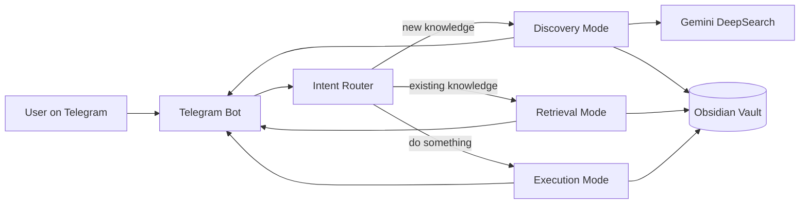

# SARAS — Implementation Guide

2026-09-21 · @Someone

## Setup

Before writing code, get every account and tool in place.

### Prerequisites

- Python 3.11 or newer
- Git
- A Telegram account
- A Google account for Gemini API access
- Obsidian installed locally (the Vault is just a folder, so this is optional but recommended for browsing notes)

### Accounts and API keys

| Service | What you need | Where to get it |
| --- | --- | --- |
| Telegram | A bot token | Message @BotFather, run `/newbot` |
| Gemini DeepSearch | An API key | Google AI Studio (ai.google.dev) |
| NotebookLM | No public API today | Manual for now — see note below |
| Obsidian Vault | A local folder path | Any folder, opened in Obsidian as a vault |

NotebookLM has no public API for programmatic access yet. Until one exists, "NotebookLM" outputs in Discovery Mode are produced by Gemini directly (study guides, summaries) rather than the NotebookLM product itself. Revisit this once an API ships.

### Project scaffolding

```bash
mkdir saras && cd saras
python3 -m venv .venv
source .venv/bin/activate
git init
mkdir -p saras/bot saras/core/modes saras/integrations tests
touch saras/__init__.py saras/main.py saras/config.py
touch .env .gitignore requirements.txt README.md
printf ".venv/\n.env\n__pycache__/\n*.pyc\n" >> .gitignore
```

### Dependencies

`requirements.txt`:

```text
python-telegram-bot==21.*
google-genai
python-dotenv
pytest
```

Install with `pip install -r requirements.txt`.

### Configuration (.env)

```env
TELEGRAM_BOT_TOKEN=
GEMINI_API_KEY=
OBSIDIAN_VAULT_PATH=/absolute/path/to/your/vault
```

Never commit `.env` — it is already in `.gitignore` above.

### Verify the setup

Run a minimal echo bot to confirm the token and library work before building any mode logic. A reply on Telegram means setup is complete.

## Implementation

### Architecture at a glance



### Message flow

1. Telegram delivers the user's message to the bot process.
2. The Intent Router classifies it as Discovery, Retrieval, or Execution (or a chain of them).
3. The matching mode runs, using Gemini and/or the Vault.
4. The mode returns a reply, which the bot sends back to Telegram.
5. Anything worth keeping is written to the Vault before the turn ends.

### Intent Router

Start rule-based — a lightweight classifier is enough for a solo v1.

- Keyword pass first: "research", "explain", "what is" lean Discovery; "what did I", "remind me" lean Retrieval; "help me plan", "break down", "organize" lean Execution.
- No confident keyword match → ask Gemini to classify with a short prompt returning one of the three labels.
- A request can chain modes (Discovery then Execution) — detect a second clause ("then", "and help me") and run the modes in sequence.

### Discovery Mode

Discovery turns a question into stored knowledge:

1. Send the query to Gemini DeepSearch (or Gemini with search grounding, until DeepSearch is directly available).
2. Synthesize the sources into an explanation matched to the user's stated level.
3. Format the result as a Markdown note with frontmatter (title, date, tags, sources).
4. Write the note to the Vault under a `Discovery/` folder, linking related existing notes by title.
5. Reply with the explanation itself, not just a link to the note.

### Retrieval Mode

Retrieval searches before it answers:

1. Search Vault markdown files for matching titles, tags, and body text (keyword search for v1; an embeddings index is a natural upgrade later).
2. Rank matches by recency and keyword overlap.
3. If a strong match exists, answer from it and cite the note.
4. If nothing relevant exists, say so plainly and offer to switch to Discovery Mode.

### Execution Mode

Execution turns knowledge into tasks:

1. Parse the objective and deadline from the message.
2. Ask Gemini to break it into an ordered task list with estimated effort.
3. Write the plan to the Vault as a checklist note, linked to any relevant Discovery notes.
4. Reply with the plan; later messages can update the note's checklist items.

### Persistence rule

Only write to the Vault when a result has lasting value — completed research, a decision, a task plan. Skip small talk and clarifying exchanges.

## Code needed

### File structure

```text
saras/
├── main.py
├── config.py
├── bot/
│   └── telegram_bot.py
├── core/
│   ├── router.py
│   └── modes/
│       ├── discovery.py
│       ├── retrieval.py
│       └── execution.py
├── integrations/
│   ├── gemini_client.py
│   └── obsidian_vault.py
├── tests/
├── requirements.txt
└── .env
```

### config.py

```python
import os
from dotenv import load_dotenv

load_dotenv()

TELEGRAM_BOT_TOKEN = os.environ["TELEGRAM_BOT_TOKEN"]
GEMINI_API_KEY = os.environ["GEMINI_API_KEY"]
OBSIDIAN_VAULT_PATH = os.environ["OBSIDIAN_VAULT_PATH"]
```

### integrations/gemini\_client.py

```python
from google import genai
from saras.config import GEMINI_API_KEY

_client = genai.Client(api_key=GEMINI_API_KEY)

def ask(prompt: str, model: str = "gemini-2.5-flash") -> str:
    response = _client.models.generate_content(model=model, contents=prompt)
    return response.text

def classify_intent(message: str) -> str:
    prompt = (
        "Classify this message into exactly one word: "
        "discovery, retrieval, or execution.\n\n"
        f"Message: {message}"
    )
    return ask(prompt).strip().lower()
```

### integrations/obsidian\_vault.py

```python
import os
from datetime import date
from saras.config import OBSIDIAN_VAULT_PATH

def write_note(folder: str, title: str, body: str, tags: list[str]) -> str:
    folder_path = os.path.join(OBSIDIAN_VAULT_PATH, folder)
    os.makedirs(folder_path, exist_ok=True)
    filename = f"{title.replace('/', '-')}.md"
    path = os.path.join(folder_path, filename)
    frontmatter = (
        "---\n"
        f"title: {title}\n"
        f"date: {date.today().isoformat()}\n"
        f"tags: [{', '.join(tags)}]\n"
        "---\n\n"
    )
    with open(path, "w", encoding="utf-8") as f:
        f.write(frontmatter + body)
    return path

def search_notes(query: str, limit: int = 5) -> list[str]:
    matches = []
    for root, _, files in os.walk(OBSIDIAN_VAULT_PATH):
        for name in files:
            if not name.endswith(".md"):
                continue
            path = os.path.join(root, name)
            with open(path, encoding="utf-8") as f:
                content = f.read()
            if query.lower() in content.lower():
                matches.append(path)
            if len(matches) >= limit:
                return matches
    return matches
```

### core/router.py

```python
from saras.integrations.gemini_client import classify_intent

KEYWORDS = {
    "discovery": ["research", "explain", "what is", "how does"],
    "retrieval": ["what did i", "remind me", "last time"],
    "execution": ["help me plan", "break down", "organize", "due"],
}

def route(message: str) -> str:
    lowered = message.lower()
    for mode, words in KEYWORDS.items():
        if any(w in lowered for w in words):
            return mode
    return classify_intent(message)
```

### core/modes/discovery.py

```python
from saras.integrations.gemini_client import ask
from saras.integrations.obsidian_vault import write_note

def run(message: str) -> str:
    explanation = ask(f"Research and explain clearly: {message}")
    write_note(folder="Discovery", title=message[:60], body=explanation, tags=["discovery"])
    return explanation
```

### core/modes/retrieval.py

```python
from saras.integrations.obsidian_vault import search_notes

def run(message: str) -> str:
    matches = search_notes(message)
    if not matches:
        return "I don't have anything on that in the Vault yet — want me to research it instead?"
    return "Here's what I found:\n" + "\n".join(matches)
```

### core/modes/execution.py

```python
from saras.integrations.gemini_client import ask
from saras.integrations.obsidian_vault import write_note

def run(message: str) -> str:
    plan = ask(f"Break this into an ordered checklist of tasks: {message}")
    write_note(folder="Execution", title=message[:60], body=plan, tags=["execution"])
    return plan
```

### bot/telegram\_bot.py

```python
from telegram.ext import ApplicationBuilder, MessageHandler, filters
from saras.config import TELEGRAM_BOT_TOKEN
from saras.core.router import route
from saras.core.modes import discovery, retrieval, execution

MODES = {"discovery": discovery.run, "retrieval": retrieval.run, "execution": execution.run}

async def handle_message(update, context):
    mode = route(update.message.text)
    reply = MODES.get(mode, discovery.run)(update.message.text)
    await update.message.reply_text(reply)

def main():
    app = ApplicationBuilder().token(TELEGRAM_BOT_TOKEN).build()
    app.add_handler(MessageHandler(filters.TEXT & ~filters.COMMAND, handle_message))
    app.run_polling()
```

### main.py

```python
from saras.bot.telegram_bot import main

if __name__ == "__main__":
    main()
```

This is a v1 skeleton — each piece is small and replaceable, matching the modularity principle from the project spec.

## Tests

Keep tests simple and fast — this is a solo project, not an enterprise system. Mock Gemini and Telegram; never hit real APIs in automated tests.

### What to test

| Area | What matters |
| --- | --- |
| Router | Keyword matches route correctly; ambiguous text falls back to classification |
| Discovery | A note is written to the Vault with correct frontmatter and folder |
| Retrieval | A matching query returns the note; no match returns the fallback message |
| Execution | Output is a non-empty checklist written to the Vault |
| Obsidian Vault | `write_note` creates the file; `search_notes` finds a known string |

### tests/test\_router.py

```python
from saras.core.router import route

def test_discovery_keyword():
    assert route("Explain how transformers work") == "discovery"

def test_retrieval_keyword():
    assert route("What did I learn about Docker last month?") == "retrieval"

def test_execution_keyword():
    assert route("Help me plan my ML project due Friday") == "execution"
```

### tests/test\_obsidian\_vault.py

```python
from saras.integrations import obsidian_vault

def test_write_and_search_note(tmp_path, monkeypatch):
    monkeypatch.setattr(obsidian_vault, "OBSIDIAN_VAULT_PATH", str(tmp_path))
    path = obsidian_vault.write_note("Discovery", "Test Note", "Some body text", ["test"])
    assert "Test Note" in open(path).read()
    results = obsidian_vault.search_notes("body text")
    assert path in results
```

### tests/test\_discovery.py

```python
from unittest.mock import patch
from saras.core.modes import discovery

@patch("saras.core.modes.discovery.write_note")
@patch("saras.core.modes.discovery.ask", return_value="A clear explanation.")
def test_discovery_writes_note(mock_ask, mock_write):
    result = discovery.run("Explain Docker")
    assert result == "A clear explanation."
    mock_write.assert_called_once()
```

### Manual end-to-end checklist

- [ ] Send a Discovery-style message and confirm a note appears in the Vault
- [ ] Send a Retrieval-style message about that same topic and confirm it's found
- [ ] Send an Execution-style message and confirm a checklist note is created
- [ ] Confirm no note is written for small talk ("hey", "thanks")

Run all automated tests with `pytest`.
